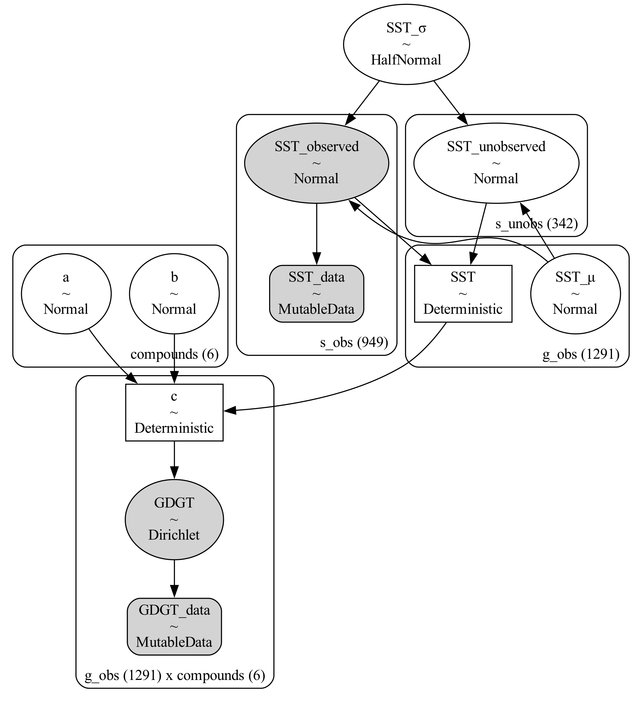

# A GDGT Proxy System Model

## Installation

Create a `conda` environment from `environment.yml`

```
conda env create --file environment.yml
```

## Overview

- A Bayesian Inference approach for a GDGT proxy system model.
- Causal dependence of GDGT compounds on sea surface temperature.
- *Dirichlet* likelihood for the six GDGT compounds.
- Build using [`PyMC`](https://www.pymc.io/welcome.html).

## Installation

## Description

- GDGT proportions as $p_i$ with $i \in [1,\ldots,6]$.
- The posterior likelihood is a *Dirichlet distribution* with concentration parameters $c_i$, $\mathcal{Dir}(\{c_1,\ldots,c_6\})$.
    - The Dirichlet distribution is a generalization of the *Beta* distribution which is a distribution suitable for the random behaviour of percentages or proportations, i.e., a distribution for a single, or univariate *random variable*. The Dirichlet distribution is therefore sometimes called *multivariate Beta* distribution. 
- The concentration parameters $c_i$ must be positive ($c_i \geq 0$) by definition.
- We assume that they depend on the sea surface temperature, $SST$ and can be described as:

$$
c_i = e^{a_i + b_i\cdot SST}.
$$


### Model graph



## Project Organization

    .
    ├── AUTHORS.md
    ├── LICENSE
    ├── README.md
    ├── data
    │   ├── external
    │   ├── interim
    │   ├── processed
    │   └── raw
    ├── docs
    ├── notebooks
    ├── reports
    │   └── figures
    └── src
        ├── data
        ├── external
        ├── models
        ├── tools
        └── visualization
